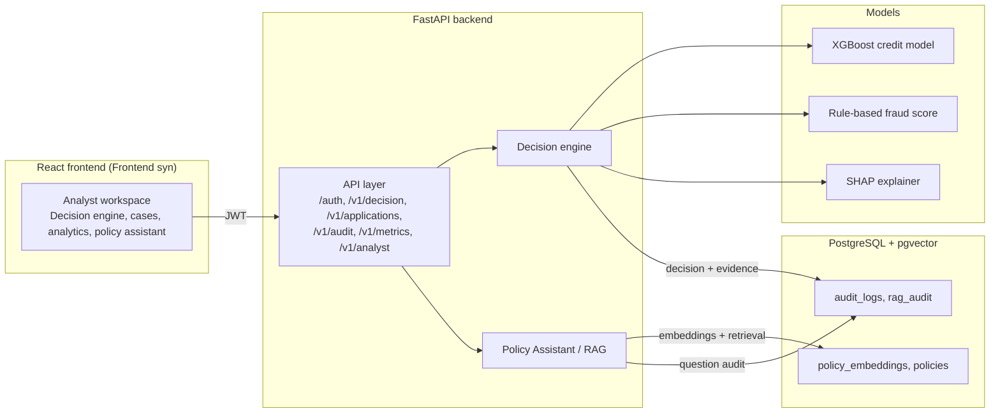
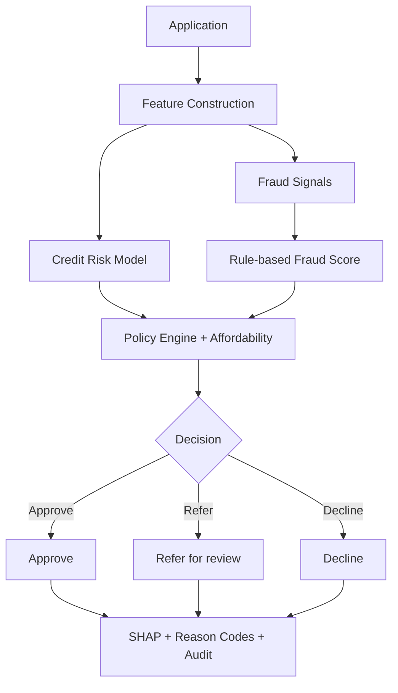

# PRISM - Underwriting Intelligence

PRISM is a prototype underwriting intelligence system for retail credit. It combines
credit-risk analysis, rule-based policy evaluation, fraud signals, and explainability so
that an analyst can understand why a given application was approved, referred, or declined.

The system is a working **prototype / demo**. It is not production lending infrastructure.
Bureau, cash-flow, and fraud inputs are simulated, and all numeric thresholds are demo values
used to illustrate the decision mechanics.

## Problem Statement

Traditional credit underwriting often depends on a long credit history. That creates
challenges for **New-to-Credit (NTC)** and **thin-file** applicants, who have little or no
history on file and can therefore be underserved.

Evaluating such applicants well requires alternative and contextual signals beyond the
traditional credit report, and doing so introduces its own risks and obligations:

- **Fraud risk** must be detected alongside thin credit data, since applicants with little
  history are harder to verify.
- **Transparent decisions** are required so an underwriter can see exactly which rule or
  score drove the outcome.
- **Explainability and auditability** are needed so every decision can be reconstructed and
  explained, including to the applicant.

## Solution

PRISM implements a deterministic, explainable decision workflow. There is no language model
in the decision path; the outcome is produced by explicit, versioned rules and a credit-risk
model, and every step is recorded.

```
Application
    |
Feature Construction
    |
Credit Risk Analysis
    |
Fraud Checks
    |
Policy Rules
    |
Final Decision
    |
Explainability / Audit
```

Each application can produce one of three outcomes:

- **APPROVE** - the application meets all policy and risk criteria.
- **REFER** - the application needs manual underwriting review (for example, elevated fraud
  score, or a requested amount that is large relative to income).
- **DECLINE** - a hard policy rule was broken, or the predicted credit risk is too high.

## Key Features

- **Application management** - submit an application with applicant details plus
  device/IP behavioral signals; list and inspect past applications.
- **Credit-risk scoring** - an XGBoost model (with a logistic-regression baseline) scores
  predicted default risk on the canonical feature set.
- **Rule-based fraud detection** - a deterministic fraud score from application-velocity
  and identity-consistency signals.
- **Policy-rule evaluation** - a deterministic policy engine applies hard guardrails
  (minimum age, expense-to-income ratio, severe delinquency) that a model cannot override.
- **SHAP / model explainability** - per-decision feature attribution for the credit model,
  kept separate from policy reason codes.
- **Decision reason codes** - plain-English adverse-action reasons attached to every
  non-approve decision.
- **Underwriting inspection workspace** - a full analyst frontend with an applications hub,
  a 360-degree case dossier, and a decision engine.
- **Policy Assistant / RAG** - a read-only assistant that answers analyst questions over
  the policy corpus with grounded citations.
- **Audit trail** - every decision and RAG question is written to an append-only log
  (PostgreSQL, with a JSONL fallback).
- **Model evaluation** - a metrics endpoint and offline scripts report AUC, precision,
  recall, and related scores for the trained models.
- **Thin-file applicant scenarios** - the workspace surfaces derived applicant profiles
  (segment, risk band, income stability, and similar) for cases with limited history.

## Architecture



### Frontend

A React 19 + TypeScript + Vite + Tailwind single-page app in `Frontend syn/`. It provides an
analyst workspace: applications hub, decision engine, 360-degree case dossier, policy
assistant, analytics, and authentication. It talks to the backend over a typed API client and
renders real decision snapshots (no mock data).

### Backend

A FastAPI service in `app/` exposing REST endpoints for authentication, decisioning,
applications, audit, metrics, and the RAG analyst endpoint. It uses Pydantic v2 schemas,
JWT auth with role enforcement, and slowapi rate limiting. OpenAPI docs are available at
`/docs`.

### Decision Engine

In `app/decisioning/` it orchestrates feature construction, credit scoring, fraud scoring,
policy evaluation, and the final approve/refer/decline decision, then assembles the
explanation and audit record.

### ML / Explainability

In `app/models/` and `app/explain/`. The credit model is an XGBoost classifier trained on
the Give Me Some Credit dataset. Fraud in the live pipeline is rule-based. SHAP produces
per-decision feature attribution. A standalone XGBoost fraud model (IEEE-CIS) is included as
a demonstration only.

### Database

PostgreSQL with the pgvector extension (see `docker-compose.yml` and `db/schema.sql`).
It stores applications, features, decisions, the audit trail, and the policy corpus with
vector embeddings and full-text search indexes. When the database is unavailable, the audit
layer falls back to local JSONL files.

### RAG / Policy Assistant

In `app/rag/`. Policy documents (an authored underwriting policy plus seven RBI regulatory
PDFs) are chunked, embedded with `bge-small-en-v1.5`, and stored in pgvector. At query time
the system performs dense + full-text retrieval with reciprocal-rank fusion, re-ranks with a
cross-encoder, and answers via a provider-agnostic LLM client with grounding and guardrails.
It is read-only and never changes a decision.

## Decision Flow



The decision is deterministic: any broken hard policy rule declines the application; a high
fraud score or an affordability concern refers it for review; otherwise the credit-risk score
determines the outcome. Every outcome is explained with SHAP attribution and policy reason
codes and written to the audit log.

## API Endpoints

| Method | Path | Description | Access |
|--------|------|-------------|--------|
| GET | `/health` | Liveness check | Public |
| POST | `/auth/login` | Issue a JWT | Public (rate-limited 5/min) |
| POST | `/v1/decision` | Run the decision pipeline | Analyst / Admin |
| GET | `/v1/applications` | List applications | Analyst / Admin |
| GET | `/v1/applications/{id}` | Application detail snapshot | Analyst / Admin |
| GET | `/v1/metrics/model-eval` | Model evaluation metrics | Analyst / Admin |
| POST | `/v1/analyst/ask` | Ask the policy assistant (RAG) | Analyst / Admin |
| GET | `/v1/audit/logs` | Read the audit trail | Admin only |

## Authentication and Roles

Two seeded demo users exist:

| Username | Password | Role |
|----------|----------|------|
| `analyst` | `analyst123` | Analyst |
| `admin` | `admin123` | Admin |

Most decisioning and read endpoints accept analyst or admin. Reading the audit trail is
admin-only.

## Getting Started

### Run with Docker (recommended)

The fastest way to run the whole stack (PostgreSQL + pgvector, backend, and
frontend) is with Docker Compose. You do **not** need to install Node, npm,
Python, PostgreSQL, or pgvector yourself.

Requirements:

- [Docker Desktop](https://www.docker.com/products/docker-desktop/) (installed
  and **running**; it bundles Docker Compose)

#### Step 1: Clone and enter the project

```bash
git clone <repository>
cd <repository>
```

#### Step 2: Build and start everything

```bash
docker compose up --build
```

- The first build takes a few minutes: the backend image trains the credit
  model from the committed dataset, and the frontend installs its npm
  dependencies and builds the static bundle.
- This command starts **three services together**: `postgres` (PostgreSQL +
  pgvector), `backend` (FastAPI), and `frontend` (the Vite UI).
- Once ready, the backend applies the DB schema automatically, ingests the
  policy corpus for the RAG assistant, and starts serving.

#### Step 3: Open the app

- Frontend (UI): http://localhost:5173
- API docs (Swagger): http://localhost:8000/docs

#### Step 4: Log in

| Username | Password | Role |
|----------|----------|------|
| `analyst` | `analyst123` | Analyst |
| `admin` | `admin123` | Admin |

#### Stopping and managing the stack

| Task | Command |
|------|---------|
| Start in the background (no logs in the terminal) | `docker compose up -d --build` |
| View live logs | `docker compose logs -f` |
| Logs for one service | `docker compose logs -f backend` |
| See container status | `docker compose ps` |
| Stop (database data is **kept**) | `docker compose down` |
| Stop **and delete** database data | `docker compose down -v` |
| Rebuild after code changes | `docker compose up -d --build` |

> Data is stored in a named Docker volume (`prism-underwriting_pgdata`), so
> `docker compose down` keeps it and a later `docker compose up` restarts with
> the same data. Use `docker compose down -v` only if you want a clean slate.

#### Optional configuration

Copy `.env.example` to `.env` to override defaults:

```bash
cp .env.example .env
```

Relevant variables:

- `VITE_API_BASE_URL` - where the browser calls the backend (default
  `http://localhost:8000`; change only if the backend is on a different host).
- `LLM_API_KEY` / `LLM_BASE_URL` / `LLM_MODEL_ID` (or `GEMINI_API_KEY`) - an
  LLM for the policy assistant. Leave blank to use the offline, grounded
  fallback.
- `JWT_SECRET` - change this for anything other than local demo use.

All defaults are local demo values; the seed users `analyst` / `analyst123`
and `admin` / `admin123` are demo credentials.

#### Troubleshooting

- **"port is already allocated" on 5173 or 8000** - something else on your
  machine (e.g. a local `npm run dev` or `uvicorn`) is using the port. Stop
  that process, then retry.
- **Postgres is not published on host port 5432** - the backend reaches it
  over the internal Docker network only. This is intentional, so it does not
  conflict if you already run Postgres locally.
- **First RAG / policy-assistant query is slow** - the embedding and
  reranker models (~220 MB total) download once on first use. Later queries
  are fast.

### Manual (without Docker)

### Prerequisites

- Python 3.10+
- Node 18+ / npm
- Docker Desktop (for PostgreSQL + pgvector)

### 1. Database (optional for the demo; audit falls back to JSONL)

```bash
docker compose up -d
```

### 2. Backend

```bash
python -m venv .venv
.venv\Scripts\activate
pip install -r requirements.txt
```

### 3. Train the credit model

```bash
.venv\Scripts\python.exe ml\train_credit.py
```

This writes the model artifacts under `app/models/artifacts/` and `ml/feature_metadata.json`.

### 3b. Train the fraud demo model (optional, standalone)

Requires the IEEE-CIS files in `ieee-fraud-detection/`:

```bash
.venv\Scripts\python.exe ml\train_fraud.py
```

The live pipeline stays rule-based; this is a demonstration of ML fraud detection.

### 4. Run the API

```bash
.venv\Scripts\python.exe -m uvicorn app.main:app --reload
```

Interactive docs: http://localhost:8000/docs

### 5. Run the frontend

```bash
cd "Frontend syn"
npm install
npm run dev
```

Open http://localhost:5173 and log in with one of the demo users.

## RAG / Policy Assistant Setup

The policy assistant retrieves over the policy corpus stored in pgvector. With Docker
running, ingest the policy documents so the embeddings are populated:

```bash
.venv\Scripts\python.exe -m app.rag.ingest
```

Set the LLM configuration in `.env` (see `.env.example`): `LLM_API_KEY`, `LLM_BASE_URL`,
and `LLM_MODEL_ID`. The system is provider-agnostic and defaults to Groq
(`groq/compound-mini`). If no key is present, the assistant falls back to an offline,
grounded answer. The embedding and reranker models download on first use.

## Model Evaluation

```bash
.venv\Scripts\python.exe ml\evaluate.py
```

Current reported results (see `ml/data/`):

- Credit model: XGBoost AUC ~0.87 versus a logistic-regression baseline ~0.80, with improved
  recall at the decision threshold.
- Fraud model (IEEE-CIS, standalone demo): XGBoost AUC ~0.94.

## Tests

```bash
.venv\Scripts\python.exe -m pytest tests/ -v
```

The suite covers the policy engine, feature builder, fraud signals, decision pipeline,
security and roles, RAG and reranking, edge cases, and application endpoints.

## Known Limitations

- Bureau, cash-flow, and fraud inputs are simulated and deterministic by applicant ID.
- The credit dataset's test split has no labels, so held-out evaluation uses a stratified
  split of the training data.
- The audit trail falls back to local JSONL files when PostgreSQL is unavailable.
- The RAG assistant uses a configurable free LLM tier, which can be rate-limited; it then
  falls back to an offline grounded answer.
- The IEEE-CIS fraud model is a standalone demonstration and is not used in the live
  decision pipeline.
- This is a demo prototype, not production lending infrastructure.

## Project Layout

```
app/                FastAPI backend (API, decision engine, RAG, models)
ml/                 Model training and evaluation scripts
policies/           Policy corpus (authored markdown + RBI PDFs)
db/                 SQL schema
tests/              Backend test suite
Frontend syn/       Main React analyst workspace
docs/               Design and planning documents
```
